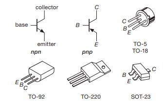

# The first Transistor Model: Current Amplifier

## Basics

A Bipolar Junction Transistor is a three terminal device. The overall concept is that a small amount of voltage applied to the *base* terminal controls the flow of a larger current moving between the *collector* and the *emitter*.

There are two variety of BJTs:
1. npn
2. pnp

*pnp* transistors have the reverse rules of *npn*. Here are the rule for ***npn***:

1. **Polarity** - The collector must be more positive than the emitter.
2. **Junctions** - The base-emitter and base-collector circuits behave like diodes in which a small current applied to the base controls a much larger current flowing between the collector and the emitter. Normally the base-emitter diode is conducting and the base-collector diode is reversed-biased (The applied voltage is the opposite direction to easy current flow).
3. **Maximum rating** - Any given transistor has a maximum value of $I_C$ $I_B$ and $V_{CE}$ that cannot be exceeded without breaking the transistor. There are also other limits, like power dissipation ($I_CV_{CE}$), temperature, and $V_{BE}$.
4. **Current Amplifier** - When the above rules are obeyed, $I_C$ is roughly proportional to $I_B$ and can be written as:
    $$
    I_C = h_{FE}I_B = \beta I_B
    $$
    Where $\beta$ is the current gain (Sometimes called $h_{FE}$), is typically around 100. both $I_B$ and $I_C$ flow towards the emitter

### Why are transistors useful?

The fourth rule 
