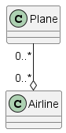

## Goals

Using UML, you can communicate what attributes and methods you want to be placed into a class, and further expand on that diagram.

Currently, it will be used as a notation for communicating how a design should be handled.

## Uses

Used specifically to describe the object-oriented model.

- Can be used to express object-oriented design visually.
- Programming language independent
- Communicates, evaluates, and reuse design.
- Makes design intent more explicit.
- There is a LaTeX package that lets you render UML diagrams.

Really, the main purpose here is to plan the design before implementing.

The following image is a good reference for a UML diagram of a class.

There are a lot of components to this notation here, so let's go over the exaplanation.

- `-` denotes a private member
- `+` denotes a public member
- `#` denotes a protected member
- `underlines` means that the member is a class/static member.

Let's talk about area of the class diagram.

- The first section is the name of the class.
- The second section is the attributes.
- The third section is the methods of the class.

### Decomposition

There are three decomposition types that can be represented via a UML. These are:

- Association
- Aggregation
- Composition

The notation that is used is a line connecting the parts. The following images showcase an example of each type.

Note that the shape side is the container side.

#### Association

#### Aggregation

#### Composition

## References

- https://www.visual-paradigm.com/guide/uml-unified-modeling-language/uml-class-diagram-tutorial/
