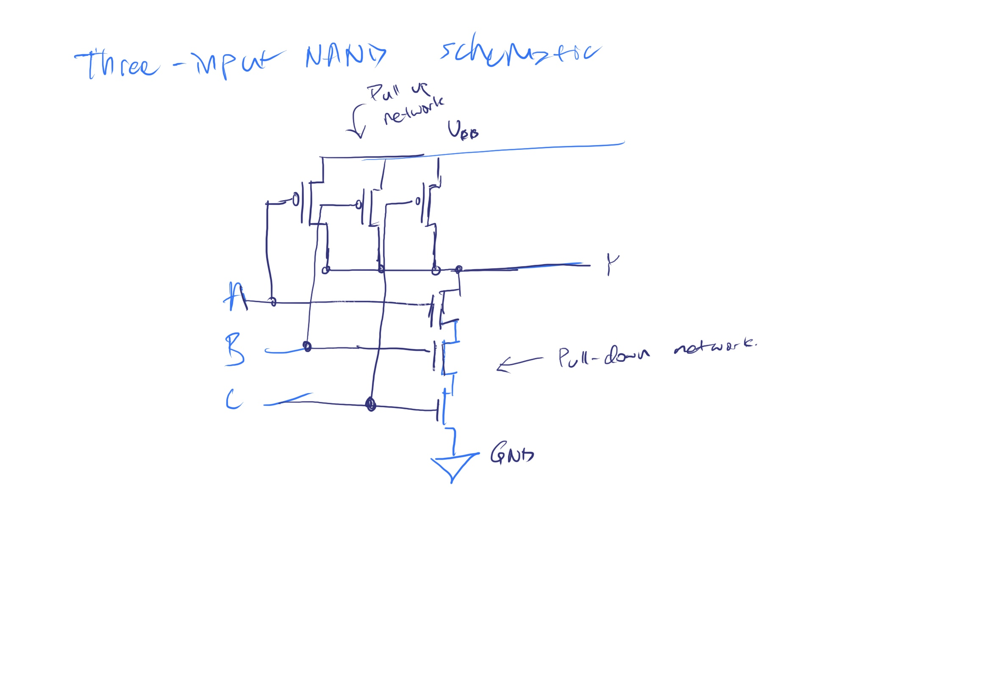
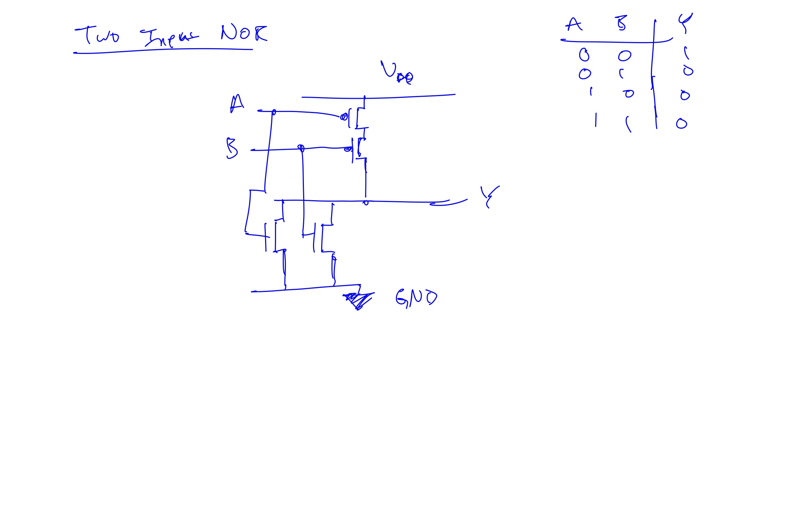
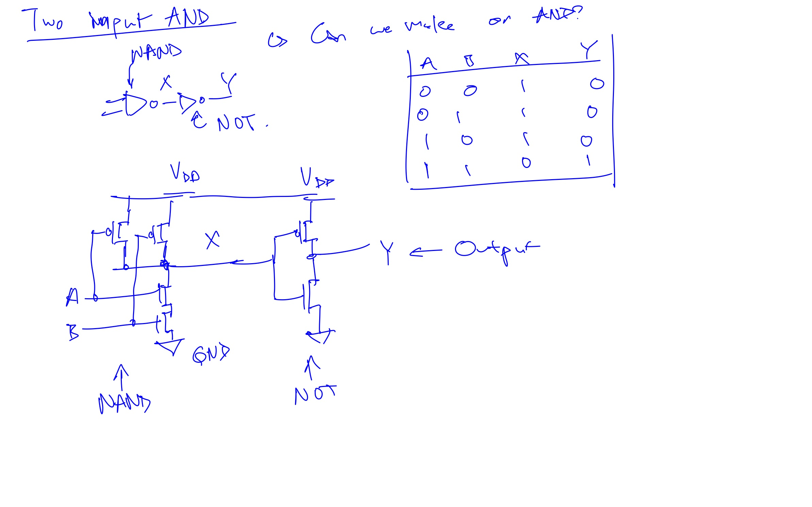

# 4. nMOS and pMOS Transistors

## What are MOSFETs

MOSFETs are built on silicon wafers through an ever increasingly complicated process, where silicon and silicon dioxide are grown in the nm scale. The advancement in this process has made it very inexpensive to produce billions of transistors at a time.

When the process is complete, and the wafer is cut into rectangles called **chip**, or **dice** where testing happens, and then packaging. In the completed package, metal pins connect the die to the circuit.

## How MOSFETs work

The MOSFET sandwich is layered as follows. There is a conducting layer placed on top of an insulating layer, that is sitting on the silicon, which is also called the substrate. The conducting layer is called a *gate* and in modern processes, it is made of **polycrystalline silicon**, however, in the past it was made out of metal-oxide-semiconductor. A shift in material occurred because polycrystalline silicon is able to withstand higher temperature that is used later in the process. That insulating layer is usually silicon dioxide (glass)(**oxide** is the industry shorthand). 

The sandwich creates a capacitor, with the silicon dioxide acting as the dielectric.

### There are two types of MOSFETs:
1. nMOS
2. pMOS

#### nMOS

There are regions of n-type dopant besides the gate, called the source and drain. The main substrate of the nMOS are p-type. 

##### Operations

The substrate of the system is usually tied to ground (GND), which is the lowest voltage of the system.
1. When the gate is also 0V, the diode between the source or the drain to the substrate are reverse biased, and since either the source or the drain has a non-negative bias. This means that current cannot flow from the source to the drain, and thus the transistor is turned off.
2. When the gate voltage is raised to $V_{DD}$, an electric field is created that will pull positive charge to the top plate, and negative charge to the bottom plate. When enough voltage, there will be so much negative charge on the bottom plate that a region of the p-type substrate will act like an n-type substrate. This region is called a *channel*, and it will give a continuous path from the n-type source to the n-type drain. Now electrons from the source can flow to the drain, and thus, the transistor is ON.

#### pMOS

Literally just the opposite of nMOS. The substrate is tied to $V_{DD}$, so when the gate is also at $V_{DD}$, the transistor is turned OFF, and when the gate is $GND$, the channel inverts to a p-type substrate, and the transistor turns ON.

The gate voltage used to turn on the transistor is called the *threshold voltage* and is denoted with $V_t$. The threshold voltage usually range from 0.3 to 0.7 V.

## Flaws

MOSFETs are great, but they are not the perfect switches. nMOS are great at passing 0s, but 1s are not perfect. When the gate of an nMOS is at $V_{DD}$, the source will only swing between 0 and $V_{DD}-V_t$ when its drain range from 0 to $V_{DD}$.

The same is true with pMOS, as it passes 1s well, but 0s poorly. Of course, engineers have developed ways to build logic with transistors only using their good modes.

## MOSFET usage

In computing, MOSFETs are usually used as voltage controlled switches. The *gate* voltage changes the state of the MOSFET between ON or OFF, which is really the state of the connection between the *source* and the *drain*. This physics is why this type of transistor is dubbed as *field effect transistors*.

## Design

nMOS needs a p-type substrate and pMOS need an n-type substrate. To build both on the same chip, manufacturers will usually start with a p-type substrate, and implant n-type regions called wells where they need to use pMOS. The process that uses both nMOS and pMOS are called Complimentary MOS, or **CMOS**. In the modern day, **CMOS** is commonly used in mostly all transistor applications.

## Summary diagram

# 5. CMOS NOT Gate

## Illustration

`Y` is the output and `A` is the controlling signal. Both the nMOS and the pMOS are connected to the output and are controlled by the same signal. When $A=0$, N1 will be OFF and P1 will be ON, allowing the $V_{DD}$ terminal to pull up the Y to $V_{DD}$, which is $Y=1$. When $A=1$, N1 will be ON, and P1 will be OFF. This lets the $GND$ pull down Y to $Y=0$.

# 6. Other CMOS Logic Gates

Another fundamental gate to know of is the NAND Gate.

This design requires four transistors, two nMOS, and two pMOS. The nMOS are in series, and lead to ground. To pull to ground, both the nMOS must be turned ON, which can be achieved by having both input set to 1. When either of of the input is OFF, a corresponding pMOS connected to $V_{DD}$ will be turned on, which will quickly pull the output up to $V_{DD}$.

## Truth Table

| A   | B   | Pull-down Network | Pull-up Network | Y   |
| --- | --- | ----------------- | --------------- | --- |
| 0   | 0   | OFF               | ON              | 1   |
| 0   | 1   | OFF               | ON              | 1   |
| 1   | 0   | OFF               | ON              | 1   |
| 1   | 1   | ON                | OFF             | 0   |

## General Form

This image illustrates the general form for creating any inverting logic gate (NOT, NOR, NAND). The important feature to know is that nMOS transistors are good at passing 0s, and pMOS transistors are good at passing 1s. This make nMOS transistors ideal for pull-down networks, and pMOS transistors good for pull-up networks.

As for the logic design, when placing the transistors in parallel, it will act like a Boolean OR, and when they are in series, they will act like a Boolean AND.

### Warning

When both the pull-up and pull-down networks are ON at the same time, a short circuit would exist between $V_{DD}$ and $GND$. This means that the output of the gate could be in the forbidden zone, and lead to undefined behaviour on that sense. The short circuit could also damage the die, so it is best to avoid this scenario.

If both the pull-up and pull-down networks are both OFF at the same time, then the output will be connected to neither $V_{DD}$ or $GND$. This is what is called a float. The output in this case is also undefined.

In most design, one of the network should be ON, and the other OFF at all times so that the output is either pulled to HIGH or LOW, but not short or floating. The thing is, some designs will use floating as an idle state. This can actually be done with the rule of **Conduction Complement**, which states that when the nMOS transistors are in series, then the pMOS transistors should be in parallel, and vice versa.

## Some practice problems

### Drawing up a three terminal NAND

### TWO-INPUT NOR

### TWO-INPUT AND

# 7. Transmission Gate

Sometimes designer will use an ideal switch that can pass both a 1 and a 0 well. To do this, just have a parallel combination of nMOS and pMOS. This is called a **transmission gate** or **pass gate**. This gate doesn't have a preference of drain and source, so it doesn't have such a naming scheme attached to it. The control signals are called **enable** $EN$ and $\bar{EN}$. When $EN=0$, $\bar{EN}=1$ and both gates are OFF. This turns the switch off. When $EN=1$, then the transistors are both ON, and thus current can flow through.

# 8. Pseudo-nMOS Logic

## Background information about speed

An N-input CMOS NOR gate will use N nMOS in parallel, and N pMOS in series. The physics is here is that transistors in parallel are faster than transistors in series, due to having a shorter circuit, not needing all the switches to be turned on, etc. Secondarily, pMOS is slower than nMOS because of the nature of electrons and holes (holes are slower than electrons). Because of these factors, nMOS in parallel are very quick, but pMOS in series are very slow. These two components happen to make up the parts of a CMOS NOR gate.

## What is Pseudo-nMOS logic?

Pseudo-nMOS logic gets rid of the network of parallel pMOS transistors and replace it with a weak pMOS that is always ON. They call this transistor a **weak pull-up transistor** and it is designed so that it will barely pass as a high when there are no pull-down transistors activated, and a single pull-down is able to turn it into a LOW state. This is how you are able to build fast NOR gates  with increasing numbers of inputs.

The downside is that there is a short circuit between $V_{DD}$ and $GND$ when the output is LOW.

This circuit got its name from older manufacturing processes, when the replaced the pMOS transistor with a weak nMOS transistor because pMOS were not available yet.

## Pointers

| Previous | [Home](ddca_risc-v_abstract.md) | [Next](ch01_08_power_consumption.md) |
| -------- | ------------------------------- | ---- |
