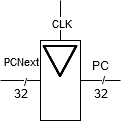
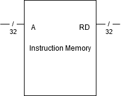
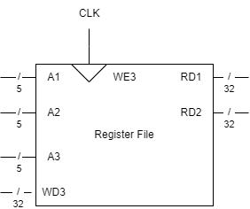
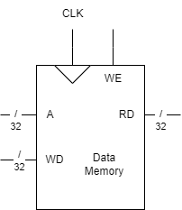

How do we put together a processor? What features do we have to try and balance together to get the most out of the money we spend manufacturing the microprocessor? How do we put together the ALU, FSM, registers and memory? This chapter covers a little of all of these topics.

## 7.1.1 Architectural State and Instruction Set

A computer architecture is defined by the instruction set and the architecture state.

- The architecture state is essentially the state in a finite state machine.
  - In RISC-V, this is the program counter and the 32 32-bit registers. Part of the RISC-V specification requires that all RISC-V processors have these components.
- Using the current architecture state, the processor can determine what instruction to execute, and the next architecture state that it should assume.
- There are some non-architectural states that are inside the architecture state machine, used for optimization or simplification of logic.

### Instruction Subset of focus

In the scope of this textbook, four types of instructions are going to be looked at. These are:

- **R-type** - `add, sub, and, or, slt` : These are three register operations.
- **Memory instructions** - `lw, sw` : These are basic memory instructions.
- **Branches** - `beq` : Branching can be used as a way to implement conditionals, or functions.

The point here is that, you should be able to make some programs using just these three types of instructions.

## 7.1.2 Design Process

A microarchitecture can be divided into two parts:

- The *control unit*
  - Takes the current instructions from the data path, and then tells the data path what to do.
  - Control of the data path is done by generating *mux select*, *register enable*, and *memory write* signals.
- The *data path*
  - Operates on words of data.
  - Has memories, registers, ALUs, and multiplexers.
  - RISC-V uses 32-bit data path.

Since CPUs are complex, we want to start the design process from the top down, which means starting with the state elements, since they control the flow of the architecture state and memory. After the state element has been created, blocks of combinational logic is added between these state elements so that the next state can be reached from the current state.

- The instructions is usually read from another part of memory using load and store. This makes it convenient to separate the instructions from the data using partitions.

This block takes an address input, and outputs the instruction located at that address through the read output. This block is combinational.

The register file allows reading and writing into the x32 32-bit registers. There are three addresses that correspond with the three IO.

- There are two read ports with two corresponding address inputs, each being 5-bit wide in order to just be enough to index the 32 registers. Address 0 is hardwired to register x0. 
- There is one write port that will input data to a register that is pointed to by `A3`. The write will only happen when the `CLK` is on its rising edge, and `WE3` write enable is active.
  - If it's not rising edge, or the write enable signal is not active, writing does not happen. <!--This design makes a lot of sense.-->

*Data memory* only has a single read port, and one write port. It is designed with only one address input, meaning that it can only read or write at a single moment.

- When the `WE` write enable signal is active, this block will write to data memory, else it is reading.

The architecture state is a sequential circuit, but it is built on top of many combinational logic blocks, with the writing being the only portion that is controlled by a clock and an enable signal. This also means that the setup for the enable signal and the address and data input must be set-up before the clock edge, and must be stable for the hold time.
