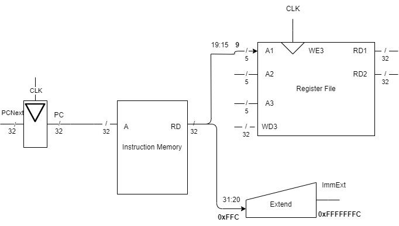

The chapter covers the microarchitecture by starting with the data-path, which is a combination of state elements and combinational logic that executes the instructions.

After this, we create the control unit, which outputs control signal that controls the data path based on the current instruction.

## 7.3.1 Sample Program

The processor that will be covered in this chapter will have loads, stores, an R-type instruction (or), and a branch (`beq`).

Some design choices:

- The program is stored in memory at the starting address `0x1000`. The following table shows the instructions that are present in this program.

| Address | | Instructions | Type | | | Fields | | | | Machine Language |
| --- | --- | --- | --- | --- | --- | --- | --- | --- | --- | --- | 
| `0x1000` | `L7:` | `lw x6, -4(x9)` | **I** | **imm{11:0}** `111111111100` | | **rs1** `01001` | **f3** `010` | **rd** `00110` | **op** `0000011` | `0xFFC4A303`
| `0x1004` | | `sw x6, 8(x9)` | **S** | **imm{11:5}** `0000000` | **rs2** `00110` | **rs1** `01001` | **f3** `010` | **imm{4:0}** `01000` | **op** `0100011` | `0x0064A423`
| `0x1008` | | `or x4, x5, x6` | **R** | **funct7** `0000000` | **rs2** `00110` | **rs1** `00101` | **f3** `110` | **rd** `00100` | **op** `0110011` | `0x0062E233`
| `0x100C` | | `beq x4, x4, L7` | **B** | **imm{12, 10:5}** `1111111` | **rs2** `00100` | **rs1** `00100` | **f3** `000` | **imm{4:1, 11}** `10101` | **op** `1100011` | `0xFE420AE3`

Here are some value assignments:

- `x5` initially contains `6`
- `x9` contains `0x2004`
- Memory location `0x2000` contains `10`
- The program counter begins at `0x1000`

Here is what the program is doing:

1. Load memory location `0x2004-4` into register `x6`. This means that `x6` now holds the value `10`
2. Store the value `10` from `x6` into memory location `0x2004+8`. `0x200C` now has the value of `10`.
3. `0b00000110` | `0b00001010` which is equal to `0b00001110` which is `14`, stored in register `x4`.
4. `beq` is comparing the same registers, so it will always equal true. This means that the program counter goes back to `L7` and the program loops forever.

## 7.3.2 Single-Cycle Datapath

Starting from the beginning, the program counter directly connect to the instruction memory.

- The program counter holds the address to the instruction that is currently being read.
- The PC directly connects with the Instruction Memory block as the address input, and the Instruction Memory fetches the actual instruction stored at that location.

After fetching the instruction, the processor must choose what actions to take.

In the example above, the first address that was accessed is the `0x1000`. This first instruction was a `lw` instruction, an **I** type register which needs a base register which holds a memory address. This was grabbed from `x9` first. This can be seen in the following diagram, where the register address was used as an input, and the memory address stored at that location was returned through the `RD1` terminal.

The machine instruction also forces an offset, which is stored as an immediate value in the instruction. For the first instruction in the example given, The value is `111111111100` stored in bit 31:20, which is also signed. This offset is thus `-4`. Since this value is going to act as an offset, it will have to be used as input for an ALU. Since this is a 32-bit system, and this is a 12-bit value, the immediate value must be converted into a 32-bit value. This is done with sign extension. Basically, the MSB of the 12-bit value is copied and pasted for the rest of the bits that are in front of the value until the MSBs are filled. The following image shows the block diagram with the extend unit added.

To get the offset to work, the output from both the extended immediate offset and the address held in the base register are added together using an ALU. The input values for the ALU must be 32-bit in length, and for this usecase, the control signal for the ALU must set the ALU for addition. The output *ALUResult* is then used to *fetch* the desired data from data memory.

